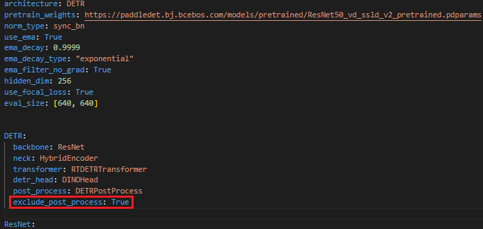
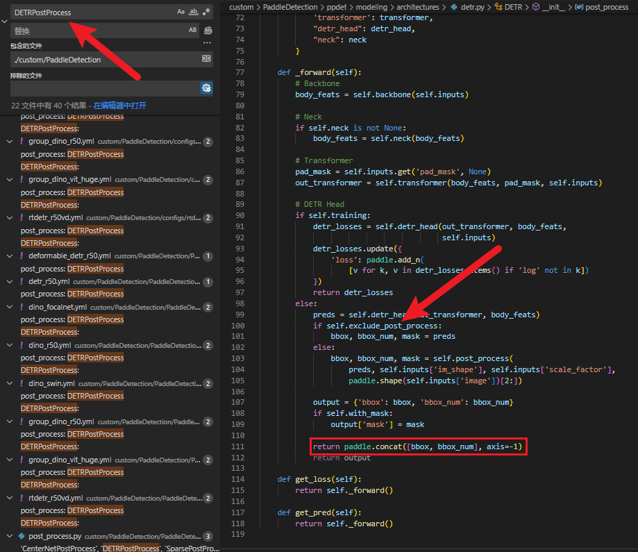
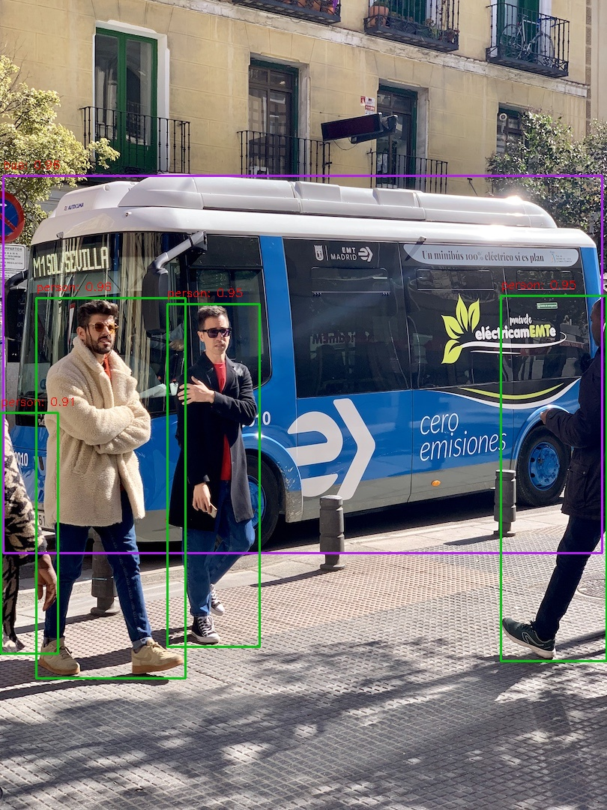
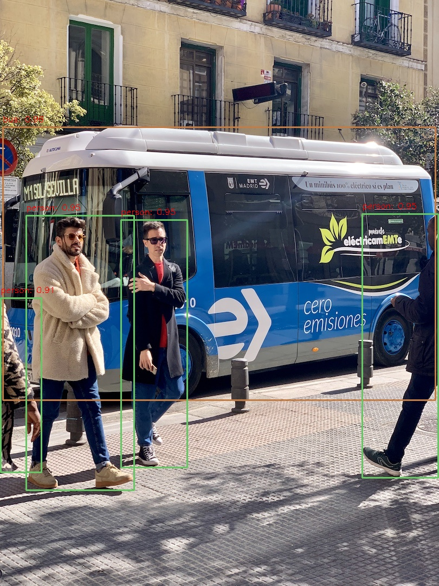

# RT-DETR-onnxruntime-project 💻

<div align="center">
  
</div>


This project showcases the deployment of the RT-DETR model using ONNXRUNTIME in C++ and Python.

## Environment Dependencies 🛠️

- OpenCV: 4.x
- ONNXRuntime: Tested on 1.14
- OS: Tested on Ubuntu 18.04
- CUDA: 11+ [Optional]

## Installation and Model Conversion 🚀

```bash
$ conda create -n rtdetr python=3.8 -y
$ conda activate rtdetr

$ python -m pip install paddlepaddle-gpu==2.4.2.post117 -f https://www.paddlepaddle.org.cn/whl/linux/mkl/avx/stable.html


# Clone PaddleDetection repository
$ git clone https://github.com/PaddlePaddle/PaddleDetection.git
$ cd PaddleDetection
$ git checkout develop

# Compile and install paddledet
$ pip install -r requirements.txt
$ python setup.py install

# Validation
$ python tools/infer.py -c configs/rtdetr/rtdetr_r50vd_6x_coco.yml -o weights=https://bj.bcebos.com/v1/paddledet/models/rtdetr_r50vd_6x_coco.pdparams --infer_img=bus.jpg
```

- Modify the configuration file [PaddleDetection/configs/rtdetr/_base_/rtdetr_r50vd.yml]:




- Modify the processing code according to the illustration [PaddleDetection/ppdet/modeling/architectures/detr.py]:




```bash
# Download the pretrained weight
$ wget https://bj.bcebos.com/v1/paddledet/models/rtdetr_r50vd_6x_coco.pdparams && mkdir weights && mv rtdetr_r50vd_6x_coco.pdparams ./weights


$ python tools/export_model.py -c configs/rtdetr/rtdetr_r50vd_6x_coco.yml \
              -o weights=https://bj.bcebos.com/v1/paddledet/models/rtdetr_r50vd_6x_coco.pdparams trt=True \
              --output_dir=output_inference

$ pip install onnx==1.13.0
$ pip install paddle2onnx==1.0.5

$ paddle2onnx --model_dir=./output_inference/rtdetr_r50vd_6x_coco/ \
              --model_filename model.pdmodel  \
              --params_filename model.pdiparams \
              --opset_version 16 \
              --save_file ./output_inference/rtdetr_r50vd_6x_coco/rtdetr_r50vd_6x_coco.onnx

$ pip3 install -U pip && pip3 install onnxsim
$ onnxsim input_onnx_model output_onnx_model

# Check the converted model [Option]
$ pip install netron

```

## Python 🐍

```bash
$ git clone https://github.com/CVHub520/rtdetr-onnxruntime-deploy.git
$ cd rtdetr-onnxruntime-deploy
$ mkdir weights
$ wget https://github.com/CVHub520/rtdetr-onnxruntime-deploy/releases/download/v1.0.0/rtdetr_r50vd_6x_coco_cvhub.onnx
$ cd ../python
$ python3 main.py
```

## C++ 🤖

```bash
$ cd rtdetr-onnxruntime-deploy
$ mkdir weights
$ wget https://github.com/CVHub520/rtdetr-onnxruntime-deploy/releases/download/v1.0.0/rtdetr_r50vd_6x_coco_cvhub.onnx
$ cd ../cplusplus
```

NOTE: To build the project, ensure that onnxruntime and opencv are correctly installed. Then, run the commands as instructed. Don’t forget to update the ONNXRUNTIME_DIR and OpenCV_DIR cmake options in the CMakeLists.txt file to match your custom environment.

```bash
$ mkdir build && cd build
$ cmake ..
$ make
$ ./main
# ./main --use_cuda
```


## Demo 🎬

<center class="half">
     
     <p style="text-align: center;">Python vs. C++</p>
</center>


## Contact 👋

Please feel free to use this project as a starting point for your own deployment needs, or as a reference for learning purposes. If you have any questions or suggestions, please don't hesitate to raise an issue or submit a pull request.


